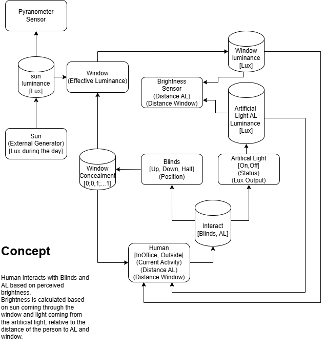

# Getting Started

## Prerequisites

- Python 2.7

Follow the installation instructions from [PythonPDEVS GitHub](https://github.com/capocchi/PythonPDEVS).
Documentation for PythonPDEVS can be found [here](https://msdl.uantwerpen.be/documentation/PythonPDEVS).

The simulation is not tested in distributed mode and mpi4py.
Theoretically it should be possible, but the customTracer is probably not working.

# Architecture



## Human

For simplicity we only keep track of elapsed time and determine if he is working based on that


## Configuration

Under [constants](util/experiment_constants.py) we define the following constants:

```python
ROOM_HEIGHT_CM = 250

# fraction of light that passes through the window glass.
WINDOW_TRANSMITTANCE = 0.8

# simplification based on the lumen method
ROOM_REFLECTANCE = 0.6

# min comfortabl lux value
MIN_LUX = 200
MAX_LUX = 1000

SUNRISE = 8.0
SUNSET = 16.0
MAX_DNI = 1000
ARTIFICIAL_LIGHT_LUMEN = 4500

ROOM_SURFACE_AREA = 50 # 3*3*2.4 room

START_MORNING_WORK = 8 * 60
FINISH_MORNING_WORK = 12 * 60
START_AFTERNOON_WORK = 13 * 60
FINISH_AFTERNOON_WORK = 17*60
```

Human is working from 8:00 to 12:00 and from 13:00 to 17:00.
When the perceived light is below 200 lux, the human will turn on the light.
When the perceived light is above 1000 lux, the human will turn off the light.
The human will first try to use the natural light from the window.
If the light is not sufficient, the human will turn on the artificial light.
When turning off the light, the human will first turn off the artificial light and then the natural light.
When the human stops working, the human will turn off the light.

Be aware that when the artificial light AL is too high (not between MIN_LUX and MAX_LUX), the human will turn off the light after 1 time unit.

## Tracing

CustomTracer is a simplified version of the XMLTracer from PythonPDEVS, because there seemed to be a bug in the XMLTracer.
CustomTracer keeps track of internal transitions from the defined models and writes their toXML string to a file.
